# JanAI – India's AI Decision Intelligence Platform
### *Empowering 1.4 Billion Citizens and Governance through Google Cloud Multimodal AI & Closed-Loop Decision Intelligence*

---

## Executive Summary

**JanAI** is a pioneering, sovereign-class **Decision Intelligence Platform** built on Google Cloud. It bridges the gap between India's massive, highly fragmented public and private data streams (Aadhaar, DigiLocker, ABDM, Smart Cities IoT, GIS, regional voice streams) and actionable, automated, and explainable decisions. 

Unlike traditional dashboards that show *what happened*, JanAI operates on a closed-loop **Observe-Reason-Recommend-Act** framework:
* **Observe**: Continuous ingestion of multimodal streams (structured database tables, sensor APIs, satellite maps, citizen audio complaints in regional languages, video cameras, and drone feeds).
* **Reason**: Cross-correlating datasets using **Gemini 2.5 Pro** and **Vertex AI** to identify underlying anomalies, systemic risks, and cross-sectoral impacts.
* **Recommend**: Generating localized, context-aware policy or operations recommendations with built-in grounding, confidence scores, and mathematical reasoning.
* **Act**: Triggering automated API-driven micro-workflows (SMS/WhatsApp notifications, municipal work orders, emergency system updates) via Cloud Workflows and Cloud Functions.

JanAI is engineered to comply with the **Digital Personal Data Protection (DPDP) Act of India** and operates at the scale of rural Panchayats to the Central Government.

---

## 1. Vision & Problem Statement

### Vision Statement
> *"To establish JanAI as the cognitive backbone of Digital India—converting fragmented municipal, social, and environmental data into hyper-localized, proactive, and equitable decisions that uplift every citizen and optimize governance in real-time."*

### Problem Statement
India generates petabytes of daily data across platforms like Aadhaar, DigiLocker, Ayushman Bharat Digital Mission (ABDM), traffic management cameras, and citizen grievance portals. However, this data exists in deep, siloed departmental vaults. 
* **Fragmentation**: A traffic congestion event does not talk to the environmental monitoring system or the emergency medical services.
* **Reactive Nature**: Government actions are primary reactive (e.g., addressing water contamination *after* a cholera outbreak, or clearing drains *during* an active flood).
* **Language & Literacy Barriers**: India's 1.4 billion population speaks over 22 official languages with varying literacy rates, preventing access to text-heavy digital interfaces.
* **Lack of Decision-Support Tools**: District Collectors and Municipal Commissioners are overloaded with raw reports, lacking predictive models to run "what-if" policy simulations before deploying public funds.

---

## 2. Target Users & Personas

JanAI addresses the entire socioeconomic spectrum of India:

| User Role | Primary Needs | Key Benefit from JanAI |
| :--- | :--- | :--- |
| **Citizens** | Multi-lingual voice assistance, basic service status, disaster alerts, grievance filing, safety tracking. | Hyper-local voice-based interactions on WhatsApp/low-bandwidth apps; proactive safety/flood notifications. |
| **District Collectors** | Rapid operational overview, resource allocation during disasters, public feedback monitoring. | "Command Copilot" to summarize grievances, cross-reference budget data, and simulate policy changes. |
| **Municipal Commissioners** | Waste management tracking, revenue leakage reduction, traffic bottleneck identification. | Real-time dashboards pointing out fleet inefficiencies, waste bin levels, and infrastructure damage. |
| **Police & Security Forces** | Crime hotspot prediction, CCTV anomaly analysis, women safety escalations. | Predictive patrol routing; automatic triggers for camera feeds during SOS alerts. |
| **Public Hospitals & Doctors** | Disease outbreak tracking (dengue, cholera), drug inventory management, patient load balancing. | Spatial disease tracking maps that alert when vector-breeding conditions (stagnant water + weather) are met. |
| **State Governments & Policy Makers** | Urban planning, climate adaptation, agriculture subsidy distribution, economic tracking. | "Policy Twin" simulations showing how urban growth impacts local water tables and power grids. |
| **Disaster Management (NDRF/SDRF)** | Real-time weather forecasting, evacuation mapping, food/medicine logistics. | Automated alerts integrating satellite runoff data, local drainage models, and population densities. |
| **Utility Companies (DISCOMs, Water)** | Grid load prediction, water main leakage tracking, bill collections optimization. | Predictive grid maintenance suggestions and anomaly detection on smart meter telemetry. |
| **Rural Panchayats (Sarpanches)** | Soil health, water pump functionality, market prices for crops, local grievance handling. | Audio-first vernacular dashboard on mobile to request agricultural inputs or water pump repairs. |
| **NGOs & Ground Volunteers** | Directing relief, identifying educational gaps, public health campaigning. | Data-grounded targeting maps highlighting underserved zones for food, health, and primary education. |

---

## 3. Top 10 Multimodal AI Use Cases

```mermaid
graph TD
    UC1(1. Healthcare Outbreak Predictor)
    UC2(2. Multimodal Flood Coordinator)
    UC3(3. Suraksha: Safe Passage for Women)
    UC4(4. Dynamic Transit Optimizer)
    UC5(5. Swachh-AI: Smart Waste Dispatch)
    UC6(6. Multi-lingual Tourist Guide)
    UC7(7. Krishi-Gyan: Agri-Risk Mitigator)
    UC8(8. Jan-Grievance: Voice-First Redressal)
    UC9(9. Shiksha-Link: Personalized Tutor)
    UC10(10. Paryavaran: Clean Air Sentinel)
```



### Use Case 1: Healthcare Outbreak Predictor (Public Health)
* **Problem**: Infectious diseases (Dengue, Malaria, Cholera) spread rapidly due to delayed detection in urban slums and rural areas.
* **AI Solution**: Gemini analyzes public hospital admissions data, weather forecasts, and satellite imagery of stagnant water bodies. Machine Learning models predict outbreak probabilities 14 days in advance.
* **Business Impact**: Saves costs on emergency medical deployment; reduces employee absenteeism.
* **Social Impact**: Lowers mortality rates, protects vulnerable low-income populations from out-of-pocket health shocks.
* **Google Cloud Services**: Vertex AI AutoML (forecasting), BigQuery Omni (data consolidation), Google Earth Engine (satellite water tracking).

### Use Case 2: Multimodal Flood Coordinator (Disaster Management)
* **Problem**: Heavy monsoon rainfall causes urban flash floods (e.g., Mumbai, Chennai), trapping citizens and stalling emergency vehicles.
* **AI Solution**: Ingests real-time water levels from river sensors, rain gauges, and social media text/images. Predicts flood heights using hydrology models and generates evacuation routes.
* **Business Impact**: Minimizes infrastructure and commercial property damage.
* **Social Impact**: Prevents loss of life and reduces response times for emergency rescue services (NDRF).
* **Google Cloud Services**: Pub/Sub (IoT stream ingestion), Cloud Run (microservices), Vertex AI, Google Maps Platform (dynamic routing).

### Use Case 3: Suraksha: Safe Passage for Women (Public Safety)
* **Problem**: Unsafe urban corridors at night with dark stretches and poorly positioned police patrols.
* **AI Solution**: Correlates street-level lighting data, density of active shops (from Maps), crime logs, and emergency call volumes. Suggests dynamic police patrol paths and triggers panic alert workflows when a citizen activates SOS.
* **Business Impact**: Promotes 24/7 retail and public transit usage, boosting local night economy.
* **Social Impact**: Enhances physical safety, independence, and comfort for women and late-night workers.
* **Google Cloud Services**: Vision AI (CCTV monitoring for unlit streetlights), Cloud Functions (triggering alerts), Firebase Cloud Messaging.

### Use Case 4: Dynamic Transit Optimizer (Smart Infrastructure)
* **Problem**: Major Indian cities suffer from severe traffic congestion, leading to high fuel wastage and delays.
* **AI Solution**: Ingests CCTV feeds, metro tap-in/tap-out data, and GPS telemetry from city buses. Uses reinforcement learning to dynamically alter traffic signal timings and optimize bus schedules.
* **Business Impact**: Reduces logistics costs and corporate transit delays; increases public transit revenue.
* **Social Impact**: Saves millions of hours of citizen commute time, reducing stress and health issues.
* **Google Cloud Services**: Cloud IoT Core (legacy/connector adapters), Vertex AI Custom Training (reinforcement learning), Looker (real-time transit dashboards).

### Use Case 5: Swachh-AI: Smart Waste Dispatch (Municipal Operations)
* **Problem**: Overfilled municipal dustbins and illegal open dumping lead to public health hazards.
* **AI Solution**: Analyzes citizen photos uploaded to grievance apps and municipal garbage truck routes. Prioritizes bin cleanups using an optimization algorithm that schedules dispatch trucks based on fuel efficiency and bin fill rates.
* **Business Impact**: Reduces fuel consumption for municipal trucks by up to 25%.
* **Social Impact**: Cleaner public spaces, reduction in disease vectors, and dignified working conditions for sanitation workers.
* **Google Cloud Services**: Document AI / Vision AI (analyzing trash density in images), Cloud Run (vehicle routing solver).

### Use Case 6: Multi-lingual Tourist Guide & Heritage Preservation (Tourism)
* **Problem**: Tourists struggle to access accurate historical contexts of Indian heritage sites in their native languages.
* **AI Solution**: An interactive agent allowing users to point their cameras at monuments. Gemini identifies the monument, structures its historical context, and narrates it in the user's local dialect.
* **Business Impact**: Boosts domestic and international tourism revenue; supports local guides and artisans.
* **Social Impact**: Preserves and democratizes access to national heritage across diverse linguistic groups.
* **Google Cloud Services**: Gemini (Vision & Translation capabilities), Text-to-Speech / Speech-to-Text.

### Use Case 7: Krishi-Gyan: Agri-Risk Mitigator (Agriculture)
* **Problem**: Smallholder farmers lose crops to unseasonal rainfall, pests, and poor soil health management.
* **AI Solution**: Ingests remote sensing data, local soil reports, and weather forecasts. Delivers hyper-local advisory messages on crop selection, water utilization, and pest remediation.
* **Business Impact**: Stabilizes agricultural supply chains for food processing companies.
* **Social Impact**: Prevents farmer debt traps, lowers suicide rates, and secures food supply.
* **Google Cloud Services**: Earth Engine, Vertex AI Feature Store, Cloud Spanner (storing massive farm profiles).

### Use Case 8: Jan-Grievance: Voice-First Redressal (Citizen Grievance)
* **Problem**: Rural and illiterate citizens cannot navigate complex online grievance portals.
* **AI Solution**: A WhatsApp voice-note based grievance lodging interface. Gemini transcribes the regional language, extracts the issue (e.g., leaking pipe), finds the location from metadata, and creates a structured ticket.
* **Business Impact**: Dramatically lowers administrative costs of manual ticket logging.
* **Social Impact**: Democratizes access to governance; makes grievance filing accessible to the illiterate.
* **Google Cloud Services**: Chirp (Universal Speech Model on Vertex AI), Translation AI, Firestore (NoSQL ticket storage).

### Use Case 9: Shiksha-Link: Personalized Tutor (Education)
* **Problem**: Severe shortage of teachers in rural government schools leading to high drop-out rates.
* **AI Solution**: Provides an interactive multimodal tutor that aligns with the NCERT/State Board syllabus, translating hard scientific concepts into stories in regional languages and grading handwritten assignments.
* **Business Impact**: Upskills the future workforce; creates scalable digital educational assets.
* **Social Impact**: Bridges the educational divide between urban private schools and rural government schools.
* **Google Cloud Services**: Vertex AI Studio (RAG with textbook corpora), Document AI (handwriting recognition).

### Use Case 10: Paryavaran: Clean Air Sentinel (Environmental Monitoring)
* **Problem**: Stubble burning, vehicle exhaust, and construction lead to severe air pollution (AQI > 400) in northern India.
* **AI Solution**: Integrates satellite smoke plume detection, traffic levels, and IoT air monitors. Runs predictive AQI models to trigger warnings to schools, recommend green corridors for traffic, and schedule dust-suppression tankers.
* **Business Impact**: Lowers public healthcare spending on respiratory diseases.
* **Social Impact**: Increases life expectancy; protects children and senior citizens.
* **Google Cloud Services**: Vertex AI pipelines, BigQuery, Maps Platform.

---

## 4. System Architecture

JanAI's architecture is built on a secure, highly scalable, and modular design. The platform leverages Google Cloud's sovereign-class infrastructure with low-latency regional services.

```
+--------------------------------------------------------------------------------------------------+
|                                    CITIZENS, GOV, & UTILITY CLIENTS                              |
|   +-------------------+     +-------------------------+     +-------------------------------+    |
|   |   Citizen App     |     |   Government Dashboard  |     |   WhatsApp Voice/Chat Client   |    |
|   +---------+---------+     +------------+------------+     +---------------+---------------+    |
+-------------|----------------------------|----------------------------------|--------------------+
              |                            |                                  |                     
              +----------------------------+----------------------------------+                     
                                           |                                                        
                                           v                                                        
+--------------------------------------------------------------------------------------------------+
|                                        API & SECURITY GATEWAY                                    |
|   +------------------------------------------------------------------------------------------+   |
|   |         Apigee API Management (Rate Limiting, Routing, API Lifecycle)                    |   |
|   +------------------------------------------------------------------------------------------+   |
|   |         Google Cloud Identity Platform (Aadhaar KYC OIDC, mPin, Biometrics)              |   |
|   +------------------------------------------------------------------------------------------+   |
+------------------------------------------|-------------------------------------------------------+
                                           |                                                        
                                           v                                                        
+--------------------------------------------------------------------------------------------------+
|                                     INFERENCE & COORDINATION LAYER                               |
|   +------------------------------------------------------------------------------------------+   |
|   |   Cloud Run / GKE (Microservices: Grievance Logging, Dispatcher, Simulator Engines)      |   |
|   +------------------------+-------------------------------------+---------------------------+   |
|                            |                                     |                               |
|                            v                                     v                               v
|   +----------------------------------+    +----------------------------------+    +--------------+   |
|   |    Vertex AI - Gemini 2.5 Pro    |    |   Agent Development Kit (ADK)    |    | Document AI  |   |
|   |   (Reasoning, Structuring, RAG)  |    |   (Healthcare, Disaster, Traffic) |    |  Speech-to-   |   |
|   +----------------+-----------------+    +--------------+-------------------+    |    Text      |   |
|                    |                                     |                        +--------------+   |
+--------------------|-------------------------------------|---------------------------------------+
                     |                                     |                                        
                     v                                     v                                        
+--------------------------------------------------------------------------------------------------+
|                                      DATA STORAGE & ANALYSIS LAYER                               |
|   +------------------------------------------------------------------------------------------+   |
|   |   BigQuery / BigLake (Structured Data, IoT Sensor Streams, GIS Maps, Earth Engine)      |   |
|   +------------------------------------------------------------------------------------------+   |
|   |   AlloyDB for PostgreSQL (Metadata, Relational, Vector Store for PGVector Embeddings)    |   |
|   +------------------------------------------------------------------------------------------+   |
|   |   Firestore (Active State, Session History, Citizen Tickets, Real-time status)           |   |
|   +------------------------------------------------------------------------------------------+   |
|   |   Cloud Storage (Raw Video feeds, Unstructured PDFs, Audio recordings, Images)           |   |
|   +------------------------------------------------------------------------------------------+   |
+------------------------------------------|-------------------------------------------------------+
                                           |                                                        
                                           v                                                        
+--------------------------------------------------------------------------------------------------+
|                                       AUTOMATION & WORKFLOWS                                     |
|   +-----------------------------------+     +-------------------------+     +--------------------+   |
|   |   Cloud Workflows (Escalations)   |     |   Cloud Pub/Sub         |     | Cloud Functions    |   |
|   +-----------------------------------+     +-------------------------+     +--------------------+   |
+------------------------------------------|-------------------------------------------------------+
                                           |                                                        
                                           v                                                        
+--------------------------------------------------------------------------------------------------+
|                                      SECURITY & GOVERNANCE                                       |
|   +------------------------------------------------------------------------------------------+   |
|   |   Cloud KMS (Envelope Encryption) & Sensitive Data Protection (PII Masking, DPDP Audit)   |   |
|   +------------------------------------------------------------------------------------------+   |
|   |   Security Command Center (Zero Trust access logs, IAM controls, threat monitoring)      |   |
|   +------------------------------------------------------------------------------------------+   |
+--------------------------------------------------------------------------------------------------+
```

### Core Architecture Components
1. **Ingress & Identity**: Requests arrive via Apigee API Gateway. Citizen identity is validated against Aadhaar/DigiLocker tokens using Google Cloud Identity Platform (OpenID Connect federated with India Stack).
2. **Compute & Orchestration**: Cloud Run hosts the stateless APIs and integration services. Complex long-running state machines (such as disaster response steps) are orchestrated using Cloud Workflows.
3. **Storage & Vector Indexes**:
   * **AlloyDB** acts as the transactional database and vector store (using `pgvector`) for storing geospatial indices and embeddings.
   * **BigQuery** serves as the data lakehouse, storing structured historical census data, crime logs, weather records, and live IoT telemetries.
   * **Cloud Storage (GCS)** stores cold unstructured data (multilingual voice notes, images, PDFs, satellite rasters).
4. **Cognitive Layer**: Vertex AI runs **Gemini 2.5 Pro** for processing unstructured multimodal prompts, translation, and agent orchestration. Document AI processes scanned PDF petitions and invoices.
5. **Monitoring & Security**: Google Cloud Monitoring and Cloud Logging capture end-to-end execution. Security Command Center ensures continuous monitoring of vulnerability profiles.

---

## 5. Specialized AI Agents

JanAI utilizes specialized, autonomous agents that execute the **Observe-Reason-Recommend-Act (ORRA)** loop.

```
       +--------------+
       |   OBSERVE    | <--- (CCTV, Rain Sensors, WhatsApp Voice, Soil Telemetry)
       +------+-------+
              |
              v
       +--------------+
       |    REASON    | <--- (Gemini 2.5 Pro, Historical BigQuery patterns)
       +------+-------+
              |
              v
       +--------------+
       |  RECOMMEND   | <--- (Generate actionable advice, Risk scoring, Grounded details)
       +------+-------+
              |
              v
       +--------------+
       |     ACT      | <--- (Cloud Functions, WhatsApp API, Dispatch ticket)
       +--------------+
```

### Agent Blueprint Examples

#### 1. Disaster Agent
* **Observe**: Hydrology sensors report river height exceeding 5.2 meters in Ward 3. Satellite radar data shows a massive storm cloud moving northeast.
* **Reason**: Cross-references topological elevation map. Finds that Wards 3, 5, and 12 are in low-lying depressions with high soil saturation.
* **Recommend**: Recommended immediate evacuation of 4,000 households in Ward 3 and 5. Reroute upcoming buses away from underpasses in Ward 12.
* **Act**: Calls the SMS/WhatsApp Gateway API to send regional warning alerts, generates a priority task inside the NDRF Control Room dashboard, and flips digital billboards along Highway 4 to "Flood Ahead - Take Route B".

#### 2. Traffic Agent
* **Observe**: CCTV cameras detect a vehicle breakdown blocking lane 1 on Outer Ring Road, Bengaluru. Traffic speeds drop from 45 km/h to 8 km/h.
* **Reason**: Calculates the ripple effect of queue propagation using deep learning modeling. Predicts gridlock at the next three intersections within 15 minutes.
* **Recommend**: recommended adjusting traffic light sequences at the upstream junctions to limit vehicle inflow, and increasing green-light intervals on the detour corridor.
* **Act**: Sends signals to the municipal traffic controller API to update the signal timers. Dispatches an automated warning to commuters on Google Maps navigation.

#### 3. Mayor Copilot / District Collector Copilot
* **Observe**: Monitors social media, local news, and citizen voice complaints for public sentiment anomalies. Detects a 400% spike in water contamination complaints in a specific block.
* **Reason**: Correlates the complaints with water supply pipeline repair works conducted by a subcontractor 48 hours ago.
* **Recommend**: Suggests freezing payments to the contractor, dispatching clean water tankers immediately, and initiating a water quality audit.
* **Act**: Drafts an official inquiry letter for the Municipal Engineer to sign, prepopulated with evidence, and initiates a tanker dispatch workflow in the municipal system.

---

## 6. RAG Architecture & Grounding

To prevent hallucinations in governance recommendations, JanAI implements a multi-tier **Retrieval-Augmented Generation (RAG)** pipeline.

```
+---------------------------------------------------------------------------------------------------------+
|                                        INGESTION & EMBEDDING PIPELINE                                   |
|  +--------------------+      +--------------------+      +--------------------+      +---------------+  |
|  | Unstructured PDFs  | ---> |   Document AI      | ---> | Vertex AI          | ---> |   AlloyDB     |  |
|  | (Govt. Schemes,    |      | (Layout Parser,    |      | Multimodal         |      | (Vector Store |  |
|  | Gazette Laws)      |      | OCR, Metadata)     |      | Embeddings Generator|     |  with index)  |  |
|  +--------------------+      +--------------------+      +--------------------+      +---------------+  |
+---------------------------------------------------------------------------------------------------------+
                                                                                               ^
+----------------------------------------------------------------------------------------------|----------+
|                                        RETRIEVAL & GENERATION PIPELINE                       |          |
|  +--------------------+      +--------------------+      +--------------------+      +-------+-------+  |
|  |    Citizen / Gov   | ---> |  Embedding Search  | ---> | Context Extraction | ---> | Gemini 2.5    |  |
|  |    Prompt Query    |      | (Semantic Match)   |      | (Top K Matches,    |      | Pro (Grounded |  |
|  |                    |      |                    |      | Metadata Filters)  |      | Response)     |  |
|  +--------------------+      +--------------------+      +--------------------+      +-------+-------+  |
+----------------------------------------------------------------------------------------------|----------+
                                                                                               |
                                             Grounds Response on Official Data Sources <--------+
```

### 1. Document Ingestion & Chunking
* Government manuals, municipal rules, land records, and welfare scheme guidelines are ingested.
* **Document AI Layout Parser** extracts structural hierarchy (chapters, tables, headers).
* Documents are segmented into chunks of 500-1000 tokens with 10% overlap to preserve context.

### 2. Multi-Vector Storage
* Text chunks and extracted images (tables, diagrams) are converted to high-dimensional vector embeddings using the **Vertex AI Multimodal Embeddings** API.
* Embeddings are indexed inside **AlloyDB** using HNSW indexing for rapid semantic lookup.

### 3. Contextual Retrieval
* When a user queries (e.g., *"How do I apply for the PM-KISAN subsidy if my land is inherited?"*), the query is vectorized.
* A hybrid search (combining exact keyword matching with semantic vector search) fetches the top 5 most relevant documents from the vector store.
* Metadata filters restrict documents based on the user's state/district (e.g., matching only Uttar Pradesh land laws).

### 4. Grounded Output Generation
* The retrieved snippets are stuffed into the Gemini context window along with a strict system prompt: *"Generate the answer utilizing only the provided context. If the context does not contain the answer, state that the information is unavailable. Provide citations to the source file name and page number."*
* Every answer undergoes an automated verification check against the source document chunks using semantic similarity scores before being sent to the client.

---

## 7. Multimodal AI & Regional Language Support

India’s digital diversity demands a platform that handles complex, heterogeneous data formats and local dialects.

* **Image Understanding**: Street photos uploaded by citizens showing potholes, broken pipes, or garbage piles are categorized by **Vertex AI Vision models**. The model measures dimensions (e.g., size of a pothole) to prioritize repair urgency.
* **Satellite & Drone Analytics**: Integrated **Google Earth Engine** runs temporal analyses on agricultural districts. By identifying changes in normalized difference vegetation index (NDVI), the platform flags crop disease or drought risk. High-resolution drone imagery is used to inspect structural damage in bridges and power lines after natural disasters.
* **Voice Complaint Processing**: Ingested audio files from WhatsApp/Voice portals are transcribed using Google's **Chirp (Universal Speech Model)**. Chirp is trained on millions of hours of regional Indian speech, supporting code-mixing (e.g., "Hinglish", "Tamil-English").
* **Document AI PDF Extraction**: Digitizes scanned administrative files, land deeds, and medical certificates, transforming them into structured JSON format.
* **Regional Language Support**: JanAI integrates a translation and localized speech generation pipeline:

```
[Citizen Audio Input] ---> [Chirp STT (e.g., Tamil)] ---> [Translation AI (Tamil -> English)] 
                                                                     |
                                                                     v
                                                            [Gemini Core Brain]
                                                                     |
                                                                     v
[Citizen Audio Output] <-- [TTS (Tamil, local accent)] <-- [Translation AI (English -> Tamil)]
```

---

## 8. Conversational Experience

Here are sample conversation flows demonstrating JanAI’s multi-lingual, voice-first capability across different personas.

### Persona 1: Citizen (Ramesh, a farmer in Bihar)
* **Channel**: WhatsApp Voice Note
* **Input (Bhojpuri/Hindi code-mixed)**: *"Humre dhaan ke patti me chota-chota peela kida lag gail ba. Pura patti sukh raha hai. Ka karein?"* (Yellow spots are appearing on my paddy leaves. The whole leaf is drying up. What should I do?)
* **JanAI Processing**:
  * Chirp transcribes and Translation AI converts to English: *"Yellow spots on my paddy leaves, drying up. What action to take?"*
  * RAG retrieves pesticide and pest diagnostic documents for Bihar.
  * Gemini identifies the symptom as **Bacterial Leaf Blight**.
  * Formulates response in Hindi with a local Bihar accent.
* **Output (WhatsApp Audio Response)**: *"Ramesh ji, aapke dhaan ki fasal me 'Bacterial Leaf Blight' (peela kida bimari) ke lakshan hain. Isse bachav ke liye, turant 25 gram Agrimycin aur 500 gram Copper Oxychloride ko 200 liter paani me mila kar prati acre chidkav karein. Dhyan rakhein, khet me pani ka jamao kam karein. Agar aapko sarkari subsidy par dawa chahiye, toh apne najdiki Krishi Kendra (PACS) par jaa sakte hain."*

### Persona 2: Government Official (District Collector, Bengaluru Rural)
* **Channel**: Government Portal Web Chat (English/Kannada)
* **Input**: *"Show me the summary of public grievances regarding drinking water in the last 24 hours. Suggest priority actions."*
* **JanAI Processing**:
  * Queries Firestore for grievances logged under "Water Supply" matching "Bengaluru Rural" within timestamp range.
  * Runs sentiment clustering on text descriptions.
  * Checks current municipal water tanker locations in BigQuery.
* **Output**: 
  > **JanAI Executive Briefing:**
  > In the past 24 hours, **47 grievances** were logged across Bengaluru Rural, with a cluster of **32 complaints** originating from **Nelamangala Taluk**.
  > 
  > *   **Primary Issue**: Low pressure and muddy water discharge.
  > *   **Root Cause**: Local pipeline damage due to road widening activities on National Highway 75.
  > *   **Confidence Level**: 94% (Correlated with NHAI construction log #4492).
  > *   **Recommended Actions**:
  >     1. **Dispatch 5 Water Tankers** from the central municipal pool to Nelamangala Ward 4 & 5 within the next 4 hours.
  >     2. **Issue Stop-Work Notice** to NHAI subcontractor until water lines are sealed.
  >     3. **Notify 1,200 residents** via automated WhatsApp messages regarding the scheduled water outage and restoration timeline (Expected: 18 hours).

---

## 9. Decision Intelligence Engine

The brain of JanAI is the **Decision Intelligence Engine**, which operates beyond static descriptive analytics. It performs three critical cognitive tasks:

### 1. Scenario Simulation ("What-If" Analysis)
Using historical trends in BigQuery and causal inference models in Vertex AI, users can simulate policy changes before implementation.
* *Example query*: *"What happens to traffic congestion on MG Road if we block heavy vehicles between 8 AM and 11 AM?"*
* *Simulation*: The engine models spatial routing patterns, simulating how logistics trucks will divert to alternative bypass roads. It outputs estimated travel time savings on MG Road vs. increase in congestion on the bypasses, along with air quality fluctuations.

### 2. Prioritization Engine & Risk Scoring
When hundreds of issues occur simultaneously, the system uses a prioritization matrix:
$$\text{Priority Score} = w_1 \cdot \text{Severity} + w_2 \cdot \text{Vulnerability Index} + w_3 \cdot \text{Ripple Effect Probability}$$
Where:
* **Severity**: Calculated via Gemini's classification of the grievance/anomaly.
* **Vulnerability Index**: Demographic data (poverty index, presence of primary schools/hospitals in the area).
* **Ripple Effect Probability**: Likelihood of secondary damage (e.g., a power outage leading to water treatment failure).

### 3. Automated Recommendation Rationale
Every recommendation contains an explanation structure:
* **Recommendation**: *"Deploy 100 metric tons of fodder to Ward 2."*
* **Causal Link**: Drought predictions show 40% reduction in local pasture grass within 10 days.
* **Evidence**: Satellite NDVI mapping data showing pasture browning, local veterinary medicine demand spikes.
* **Alternative Approaches Considered**: Importing fodder from neighboring district (Rejected due to 35% higher transit cost).
* **Risks**: Monsoon delays may rot the stock if not stored in dry government godowns.

---

## 10. Automation & Closed-Loop Workflows

To turn insights into immediate action, JanAI uses automated, programmatic workflows triggered by Google Cloud.

```
                  +--------------------------------+
                  |  AI Decision Engine Alert      |
                  +---------------+----------------+
                                  |
                                  v
                  +---------------+----------------+
                  |    Google Cloud Workflows      |
                  +---------------+----------------+
                                  |
            +---------------------+---------------------+
            |                                           |
            v                                           v
+-----------+------------+                  +-----------+------------+
|   External APIs        |                  |  Internal Escalations  |
|  - SMS Gateway         |                  |  - Create Work Order   |
|  - WhatsApp Business   |                  |  - Alert Field Officer |
|  - Emergency Siren     |                  |  - Trigger SLA Timer   |
+------------------------+                  +-----------+------------+
                                                        |
                                                        v
                                            +-----------+------------+
                                            |  SLA Expiry (48 Hours) |
                                            +-----------+------------+
                                                        |
                                                        v
                                            +-----------+------------+
                                            | Escalate to Collector   |
                                            +------------------------+
```

### Automation Workflows
1. **Field Task Generation**: When a pothole or leaking pipe is detected via citizen images, the system logs a structured ticket in the municipal database. It automatically drafts a work order, attaches the geolocations, assigns it to the nearest field engineer, and tracks their completion via photo verification (requiring the engineer to upload a "fixed" photo).
2. **Multi-tier Escalation Engine**:
   * **Level 1**: Ticket assigned to the local sanitary/water inspector. SLA timer starts (e.g., 24 hours for water contamination).
   * **Level 2**: If no action is taken within 24 hours, the ticket escalates to the Deputy Commissioner, triggering an automated phone alert.
   * **Level 3**: If unresolved in 48 hours, the ticket is added to the District Collector’s morning review dashboard with an alert label.
3. **Emergency Dissemination**: During flash flood predictions, Cloud Workflows coordinates:
   * Direct SMS alerts to all cell tower IDs inside the danger zone.
   * Automated voice broadcasts on local community radio towers via TTS.
   * Automated API calls to police control centers to dispatch rescue boats.

---

## 11. Responsible AI & Trust

JanAI places ethical guidelines, transparency, and data sovereignty at its core.

* **Grounding & Halucination Control**: The system disables Gemini's default creative generation. All responses must match document chunks retrieved through our RAG system. We utilize Vertex AI's grounding parameters, comparing output embeddings against the source documents. Any output failing a 0.85 similarity check is discarded and rewritten.
* **Explainability (XAI)**: We use **LIME/SHAP** integration in Vertex AI models to show which parameters (e.g., weather data, historical municipal responses, population density) drove a prediction.
* **Bias Detection & Mitigation**: The prioritization algorithm is continuously audited to ensure it doesn't systematically deprioritize poorer villages or neighborhoods due to lower historical digital reporting rates. We artificially balance priority scores based on local poverty indices.
* **DPDP Act 2023 Compliance**:
  * **Explicit Consent**: Citizen data is collected only after clear, local-language voice/text consent.
  * **Data Minimization**: Personal identifiable information (PII) like Aadhaar numbers are masked upon ingestion using the Google Cloud Sensitive Data Protection API.
  * **Right to Erasure**: Citizens can send a "Delete My History" request on WhatsApp, which triggers a workflow purging their personal history from Firestore and AlloyDB.
* **Immutability & Audits**: All decisions made by AI agents, along with the source files they read, are logged in an immutable BigQuery audit table for external civic auditing.

---

## 12. Security Architecture

```
+---------------------------------------------------------------------------------------------------------+
|                                           ZERO TRUST POLICY ENGINE                                      |
|  +-----------------------------+      +-----------------------------+      +-------------------------+  |
|  |     Context-Aware Access    | ---> |        VPC Service Controls | ---> |    IAM Access Policies   |  |
|  | (Device, Geo, Network check) |      | (No data egress from BQ/GCS)|      | (Least privilege access)|  |
|  +-----------------------------+      +-----------------------------+      +-------------------------+  |
+---------------------------------------------------------------------------------------------------------+
                                                                                         |
                                                                                         v
                                                                             [Sensitive Data Protection]
                                                                                         |
                                                                                         v
                                                                             [Enveloped Encryption (KMS)]
```

JanAI enforces a strict **Zero Trust** security posture:
1. **Network Security & Sovereignty**: All databases (AlloyDB, Firestore, BigQuery) operate within a private VPC. **VPC Service Controls** prevent data exfiltration to external accounts. Data residency is restricted strictly to the **Mumbai and Delhi Google Cloud regions** to comply with Indian national security policies.
2. **Access Control (IAM)**:
   * Citizens access only their personal dashboard via Identity Platform JWT authentication.
   * Government officials access specific modules determined by their role (e.g., a sanitation officer cannot access citizen health records).
   * **Context-Aware Access** ensures that District Collectors can only access the Command Center from approved government networks and devices.
3. **Data Encryption**:
   * **At-Rest**: Data is encrypted using Customer-Managed Encryption Keys (CMEK) via **Cloud KMS**.
   * **In-Transit**: Standard TLS 1.3 encryption across all internal and external microservices.
   * **Field-Level Encryption**: Sensitive identifiers (phone numbers, physical addresses) are encrypted at the field level inside database systems.

---

## 13. Scalability Design

The platform scales dynamically across all tiers of Indian administration:

```
        +---------------------------------------------------------+
        |                  NATION-LEVEL (1.4B)                    |
        |              - Cloud Spanner / BigQuery Omni            |
        |              - Global multi-region replication          |
        +----------------------------+----------------------------+
                                     |
                                     v
        +---------------------------------------------------------+
        |                   STATE-LEVEL (100M)                    |
        |              - Independent tenant namespaces            |
        |              - Localized regional NLP instances         |
        +----------------------------+----------------------------+
                                     |
                                     v
        +---------------------------------------------------------+
        |                  DISTRICT/CITY (1M-10M)                 |
        |              - Dynamic node autoscaling                 |
        |              - Multi-zone high availability             |
        +---------------------------------------------------------+
```

### Scalability Strategies
* **Compute Scaling**: GKE (Google Kubernetes Engine) Autopilot and Cloud Run automatically scale stateless services from 0 to thousands of concurrent containers during disasters or massive citizen engagement events.
* **Database Partitioning**: Database tables are sharded geographically (by State and District codes).
* **Network Caching**: Edge servers via **Media CDN** cache regional language audio files, forms, and static maps to reduce latency and save cellular data for citizens with weak 3G/4G connections.
* **Optimized Language Models**: We use Gemini 2.5 Flash for rapid, low-latency conversational tasks (such as simple status checks) and reserve Gemini 2.5 Pro for complex decision-making and RAG tasks to optimize operational costs.

---

## 14. Futuristic Innovation

JanAI proposes four highly innovative features for India:

### 1. Digital Twin of the City
Integrates with Google Maps 3D visualization and municipal spatial databases to create a living 3D model of the city. Shows live traffic flows, sewer choke points, and heat zones. District Collectors can view this Digital Twin on their tablets to track localized flood heights or spot illegal land encroachment.

### 2. AI Mayor & AI District Collector
An advanced agent trained on administrative guidelines, public budgets, and civil services training material (LBSNAA curricula). Acts as an advisory counterpart, allowing mayors to prompt: *"Compare our ward's sanitation spending with the top-performing ward in Indore. What policies are we missing?"*

### 3. Urban Growth & Population Simulator
Uses cellular density data, water table depletion reports, and construction approvals to simulate urban growth 10 years into the future. Highlights potential future slum formations, water scarcity zones, and grid instability risks, allowing cities to plan infrastructure pro-actively.

### 4. Climate Copilot
Tracks local carbon footprint, urban heat islands, and public transit usage. Generates hyper-local environmental strategies (e.g., recommending micro-forest locations in concrete zones, or setting solar-panel subsidies for specific blocks to reduce grid stress).

---

## 15. UI/UX Wireframe & Design

The user experience is clean, fast, and accessible. It is optimized for low-bandwidth networks and supports screen readers and voice-first operation.

### Dashboard Mockup: District Collector Command Center

```
+-----------------------------------------------------------------------------------------+
|  JanAI - District Command Center  [District: Bengaluru Rural]         [11:43 AM IST]    |
+-----------------------------------------------------------------------------------------+
| [System Alerts]  (1) ACTIVE DISASTER: Flash Flood Risk Nelamangala (High Confidence)   |
|                  (2) Health: Outbreak Warning Ward 4 Dengue index: 8.4                 |
+-----------------------------------------------------------------------------------------+
|  [3D DIGITAL TWIN VIEW]                     |  [DECISION RECOMMENDATIONS]               |
|                                             |                                           |
|       /\  [Flooded Zone]                    |  Issue: Nelamangala Flash Flood Risk      |
|      /  \  ! (Ward 3)                       |  Confidence: 91%                          |
|     /____\                                  |                                           |
|     |    |   [Active Tankers]               |  Recommended Action:                      |
|     |    |   * * *                          |  * Dispatch 4 rescue boats to Zone C.     |
|                                             |  * Redirect traffic from NH-75 underpass. |
|                                             |  * Alert 4,200 residents via SMS.         |
|                                             |                                           |
|                                             |  [ Approve Action ]  [ Run Simulator ]   |
+-----------------------------------------------------------------------------------------+
| [Grievances] Water: 12 | Power: 8 | Waste: 24 | Public Safety: 4      [Chat with JanAI] |
+-----------------------------------------------------------------------------------------+
```

### App Mockup: Citizen WhatsApp Interface
```
[WhatsApp Chat - JanAI Citizen Assistant]
+-----------------------------------------------------------------+
| Ramesh: (Voice Note 0:12) [Transcribed: My water is muddy]      |
|                                                                 |
| JanAI: Namaste Ramesh ji. I have recorded your complaint        |
| about muddy water in Ward 2.                                    |
| Ticket ID: #WAT-48201.                                          |
|                                                                 |
| Status: Assigned to Inspector Amit Kumar.                       |
| Expected Resolution: Today, 6:00 PM.                            |
|                                                                 |
| [Track Status] [Record Another Issue] [Speak to Agent]          |
+-----------------------------------------------------------------+
```

---

## 16. KPIs

We measure the success of JanAI using clear, quantitative metrics:

| Metric Category | KPI | Target Metric |
| :--- | :--- | :--- |
| **Operations** | Citizen Grievance Resolution Time | Reduced by 45% within 6 months. |
| **Citizen Satisfaction** | CSAT Rating (WhatsApp poll) | Exceeds 85% satisfaction score. |
| **Health** | Disease Incidence (Dengue/Malaria) | 30% reduction via early breeding ground treatment. |
| **Disaster Response** | Flood Evacuation Dispatch Time | Under 10 minutes from sensor trigger to dispatch alerts. |
| **Environment** | Municipal Truck Fuel Savings | 20% reduction in carbon footprint via route optimization. |
| **Resources** | Municipal Water Waste Reduction | 15% savings on water leakage alerts. |
| **Finance** | Municipal Property Tax Leakage | 12% revenue improvement via spatial tax auditing. |

---

## 17. Business Model

JanAI utilizes a multi-pronged business model designed to sustain operational costs while providing public utility value:

1. **Sovereign Government SaaS**: A subscription license model billed annually to State Governments and Municipal Corporations based on population scale. (e.g., Tier-1 Cities: ₹50 Lakhs/year; Tier-3 Cities: ₹10 Lakhs/year).
2. **Smart Cities Integration Fees**: Billed to private system integrators who hook their IoT cameras and environmental sensors into our platform APIs.
3. **Enterprise & Utility APIs**: Charging private utility companies (DISCOMs, private water providers) for predictive demand analytics and grid risk assessments.
4. **CSR Funding**: Corporate social responsibility sponsorships from top Indian technology and manufacturing firms to deploy specialized features (e.g., Agriculture and School Education agents) in rural districts.
5. **NGO & Research Tier**: Free, limited access tier for registered NGOs and academic institutions to analyze civic trends and environmental data.

---

## 18. 90-Day MVP Plan

```
[Phase 1: Day 1-30]  ---> [Phase 2: Day 31-60] ---> [Phase 3: Day 61-90]
Research & Ingestion       Agent & Model Dev          UI Integration & Pilot
```

### Phase 1: Foundations & Data Ingestion (Day 1 - Day 30)
* Set up Google Cloud infrastructure (Mumbai Region). Configure private VPCs and Identity Platform.
* Ingest civic datasets (simulated public reports, historical weather data, municipal registers) into BigQuery.
* Set up the document ingestion pipeline using Document AI to parse city guidelines and maps.
* **Deliverable**: Functional ingestion pipelines and database vector stores.

### Phase 2: Core Model & Agent Development (Day 31 - Day 60)
* Deploy Vertex AI pipelines and integrate Gemini 2.5 Pro.
* Build the RAG engine for municipal guidelines and scheme databases.
* Configure three core agents: **Disaster Agent**, **Traffic Agent**, and **Citizen Assistant**.
* Integrate the Chirp transcription and translation models.
* **Deliverable**: Functional APIs of the three agents with test groundings.

### Phase 3: UI Integration, Pilot & Launch (Day 61 - Day 90)
* Build the mock District Command Center Web UI and the WhatsApp chatbot interface.
* Run a pilot program in one municipal ward (e.g., Nelamangala Ward, Bengaluru).
* Audit for DPDP compliance and security configurations.
* **Deliverable**: Complete end-to-end working pilot system, validated with 500 active test users.

### MVP Technical Stack
* **Frontend**: Next.js (Dashboard), React Native (Mobile), Twilio/WhatsApp Business API.
* **Backend**: Node.js & Python running on Google Cloud Run.
* **Databases**: AlloyDB for PostgreSQL, BigQuery, Firestore.
* **AI/ML**: Vertex AI (Gemini, AutoML, Chirp, Text-to-Speech), Document AI.
* **Security**: Google Cloud KMS, Sensitive Data Protection API, Identity Platform.

---

## 19. 3-Year Future Roadmap

### Year 1: Smart City Scale (100 Cities)
* Deploy JanAI across 100 Smart Cities in India.
* Integrate standard IoT sensors (pollution, smart energy meters, traffic cameras) out-of-the-box.
* Add support for 15 official Indian languages.

### Year 2: State-Wide Integrations & Agriculture Focus
* Launch state-level command centers in 10 major states.
* Roll out the **Krishi-Gyan (Agriculture) Agent** on a large scale to 5 million farmers, partnering with state agriculture extension centers.
* Deploy localized air quality and stubble-burning prediction models in Northern India.

### Year 3: Pan-India Sovereignty & Digital Twin
* scale the platform to handle 100+ million active citizens.
* Deploy complete 3D Digital Twins for all Tier-1 and Tier-2 Indian cities.
* Open an API Marketplace allowing Indian startups to build niche micro-agents on top of JanAI.

---

## 20. Finale Presentation Assets

### 60-Second Elevator Pitch
> *"Namaste. Every day, India's cities and villages generate petabytes of digital data across Aadhaar, DigiLocker, environmental sensors, and local grievances. Yet, this valuable data remains disconnected, leading to reactive governance, slow emergency responses, and language barriers for citizens.
> 
> Introducing **JanAI: India's AI Decision Intelligence Platform**. Built on Google Cloud, JanAI converts raw, multi-modal data streams into automated, explainable, and proactive actions. Our specialized agents—from the Disaster Coordinator to the Farmer Assistant—observe situations, reason through complex historical files, recommend precise strategies with grounding, and execute them automatically on WhatsApp.
> 
> From saving lives during flash floods in Mumbai to helping a farmer in Bihar diagnose crop disease in his local dialect, JanAI is the cognitive engine of a proactive, digital, and inclusive India. Thank you."*

### 10-Slide Presentation Outline
1.  **Slide 1: Title & Vision**: JanAI – India's Decision Intelligence Engine.
2.  **Slide 2: The Silent Crisis**: The cost of disconnected and reactive data in Indian cities and villages.
3.  **Slide 3: The Solution**: JanAI's Observe-Reason-Recommend-Act (ORRA) framework.
4.  **Slide 4: Platform Architecture**: Google Cloud stack (Gemini, Vertex AI, AlloyDB, BigQuery) secure by design.
5.  **Slide 5: Multimodal & Multi-lingual Engine**: Spotting road potholes via images and handling rural complaints via voice in Hindi, Tamil, Telugu, and more.
6.  **Slide 6: Specialized AI Agents**: Deep dive into the Disaster Agent, Traffic Agent, and Citizen Assistant.
7.  **Slide 7: RAG & Responsible AI**: Ensuring strict DPDP Act compliance and preventing AI hallucinations.
8.  **Slide 8: Practical Social & Economic Impact**: Our Top 10 Use Cases and expected KPI changes.
9.  **Slide 9: 90-Day MVP & Growth Roadmap**: Scaling from 1 ward to a Pan-India rollout.
10. **Slide 10: Conclusion & Call to Action**: Empowering the next leap of Digital India.

### Demo Script (Live Walkthrough)
*   **Scene 1: The Alert**: The presenter starts by showing the **JanAI Government Dashboard**. A red flashing alert appears: *"Nelamangala Ward 3 - Flash Flood Alert (91% Probability within 2 hours)."*
*   **Scene 2: The Rationale**: The presenter clicks on the alert. The screen displays the reasoning: *"Rainfall gauges report 80mm in the last hour. Soil saturation is at 98%. BigQuery history shows Ward 3 floods when rainfall exceeds 70mm under these conditions."*
*   **Scene 3: The Recommendation**: The system shows the recommendations: Evacuate zone 2, alert residents, dispatch 3 municipal trucks.
*   **Scene 4: The Automation**: The presenter clicks the **[Approve Action]** button. Instantly, a test phone on the side of the stage rings. It displays a WhatsApp message in Kannada (transliterated): *"Warning: Flooding expected in your area. Proceed to Nelamangala Primary School shelter."*
*   **Scene 5: The Citizen Voice Loop**: A mock user sends a voice note back: *"I have an elderly family member, need help."* JanAI transcribes this, alerts the rescue team dashboard, and pinpoints their location on the digital map.
*   **Scene 6: Conclusion**: The presenter highlights that the entire workflow executed in seconds using Gemini and Google Cloud.

### Potential Judges' Q&A

**Q1: How does JanAI address the Digital Personal Data Protection (DPDP) Act of India?**
*   **Answer**: *"JanAI treats privacy as a fundamental architectural pillar. We use the Google Cloud Sensitive Data Protection API to mask PII (names, Aadhaar IDs, phone numbers) during ingestion. All transactional data resides in the secure Mumbai and Delhi Google Cloud regions. Additionally, we've implemented an immutable consent register and a 'Right to Erasure' workflow via Cloud Workflows. If a citizen requests deletion, their history is purged from our systems."*

**Q2: What prevents the platform from hallucinating critical information, such as incorrect disease treatment or disaster safety routes?**
*   **Answer**: *"We address this by enforcing strict grounding and safety guardrails. We disable Gemini's default knowledge base and force the model to rely solely on our RAG vector store in AlloyDB, which contains vetted government manuals and emergency protocols. If a response does not match the source document chunks with a similarity score of 0.85 or higher, the system rejects it and defaults to a pre-verified template. Furthermore, all recommendations are verified by human operators before public dispatch during Phase 1."*

**Q3: How will the system perform in low-bandwidth rural conditions?**
*   **Answer**: *"JanAI features an asynchronous, voice-first architecture. The client frontend is light, running as a standard WhatsApp Business integration. Audio recordings are compressed on the device before transmission. We leverage Google Media CDN to cache static resources and lightweight forms at edge locations. For processing, we use Gemini 2.5 Flash for routine queries to reduce latency and bandwidth usage."*

**Q4: How does this scale cost-effectively across India’s thousands of municipalities?**
*   **Answer**: *"By utilizing serverless Google Cloud components like Cloud Run and GKE Autopilot, compute costs are incurred only when active. Furthermore, we segment queries: simple tasks (e.g., ticket checking) use the lightweight Gemini 2.5 Flash model, while complex analytical tasks (like flood forecasting) utilize Gemini 2.5 Pro. This multi-model strategy lowers token costs by up to 60%, making it highly cost-effective for smaller municipal budgets."*
